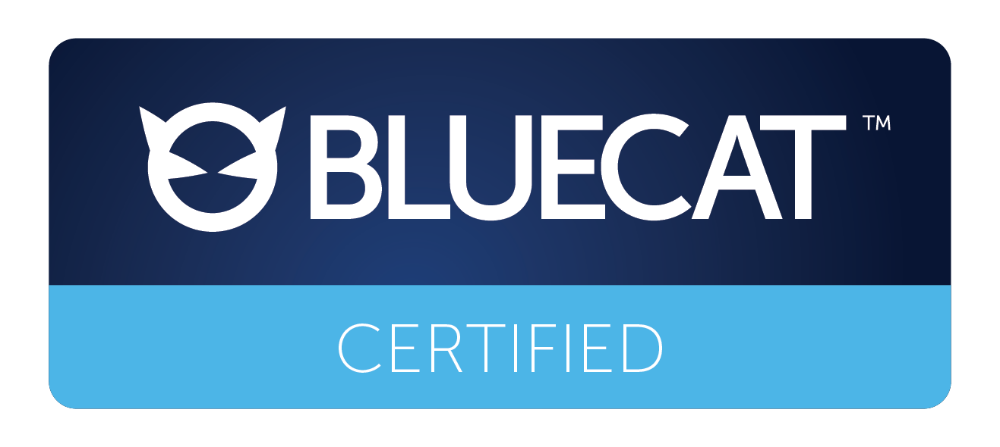

# BlueCat DNS Edge Anycast Configuration Utility
The DNS Edge Anycast Configuration Utility is designed to help you configure  service points to be added to an Anycast pool.

## Before you begin
- On the computer you use to run the configuration utility, ensure that you are running Python 3. In addition, the following Python libraries must be installed:
    - certifi==2018.8.24
    - chardet==3.0.4
    - future==0.16.0
    - idna==2.7
    - requests==2.19.1
    - six==1.11.0
    - urllib3==1.23  

  Refer to [docs.python.org](http://docs.python.org) for more information.
- This computer should also have access to the service point IP on port 443.
- Log in to the utility using your DNS Edge user ID and password. Your user account must have administrative access.

## DNS Edge version compatibility
The Anycast Configuration Utility is tested and compatible with DNS Edge service points running DNS Edge v2018.9. If a new version of the configuration utility is required for future releases of DNS Edge, it will be noted in the DNS Edge release notes.

## Clone the repo and run the configuration utility
1. Clone the anycast-cli-tool repository.
2. On a computer that can access the service point IP (port 443), and that is running Python 3, connect to the configuration utility by running any of the commands below.
4. When prompted to save your user credentials and the service point hostname and IP, type Y. A Base64-encoded file named *.script_config* is created in the same location as the anycast_config.py script. This file stores the user information, including the credentials.  

    When you no longer need to use the utility, BlueCat recommends that you delete the .script_config file.

    If you need to change your user credentials or connect to a different service point, rename or delete .script_config and restart the configuration utility.  

5. Enter your DNS Edge user name and password, and the service point hostname or IP address when prompted. Your account must have administrative access.

## Staging and applying daemon configurations

#### About the daemon configuration files
- In the following steps, for `<daemon>`, valid options are zebra, bgpd, and ospfd.
- In the following steps, for `<file>`, valid configuration files are zebra.conf, bgpd.conf, and ospfd.conf.
- When specifying configuration files, provide the full path to the files if they aren't in the same location as the anycast_config.py script. If they are in the same location, you only need to provide the file name.
- Providing a log file path in the configuration files is optional. if the path is provided, it must be /var/log/quagga/{ bgpd | ospfd | zebra }.log, or the request will be rejected with the error "Unsucessful, status code: Invalid parameters".

#### About staging and applying configurations
- You can choose to stage the configurations in one step (step 2), and then apply them in another (step 3), or you can apply the configurations in one step (step 4).
- The configuration utility enables and disables daemons when set_run_conf, and no_run_conf commands are made.

#### Staging and applying configuration files

1. If required, set Anycast loopback interfaces. The set_loopbacks command will override all configured loopback IP addresses. A maximum of 255 loopback IPv4 addresses are allowed. Loopback IPs must be specified in a /32 CIDR notation. IPv6 is not supported.
 - To set loopbacks:  
    `anycast_config.py set_loopbacks x.x.x.x/32 y.y.y.y/32 z.z.z.z/32`
 - To show the configured loopbacks:  
    `anycast_config.py show_loopbacks`  
 - To remove all configured loopbacks:  
    `anycast_config.py no_loopbacks`  

2. To stage daemon configuration files without immediately applying them, and to view or remove the staged configurations, use the following commands:  
    `anycast_config.py set_staged_conf <daemon> <file.conf>`

    For example: `anycast_config.py set_staged_conf zebra zebra.conf`  
    In this example, the .conf file is in the same location as the anycast_config.py script.

    `anycast_config.py show_staged_conf <daemon> <file.conf>`    
    `anycast_config.py no_staged_conf <daemon> <file.conf>`

3. To apply the staged configurations, use the following command:  
    `anycast_config.py apply`
4. To apply configuration files without first staging them, and to view or remove the applied configurations, use the following commands:  
    `anycast_config.py set_run_conf <daemon> <file.conf>`

    For example: `anycast_config.py set_run_conf bgpd bgpd.conf`  
    In this example, the .conf file is in the same location as the anycast_config.py script.

    `anycast_config.py show_run_conf <daemon> <file.conf>`  
	  `anycast_config.py no_run_conf <daemon> <file.conf>`
5. To stop, start, or show running daemons, use the following commands:  
    `anycast_config.py pause <daemon>` (stops the daemon)

     For example: `anycast_config.py pause bgpd`

    `anycast_config.py start <daemon>`    
	  `anycast_config.py show_daemons`

#### Example
The commands in the following example show the following steps:
1. Configure Anycast loopbacks 192.168.68.47/32.
2. Stage the zebra.conf, then the bgpd.conf, then the ospfd.conf files.  
 - In this example, the .conf files are in a different location from the anycast_config.py script.  
 - Note that Windows users should use backslashes in the file path, and Mac users should use forward slashes.  
3. Apply the staged configuration files.
4. Retrieve the contents of each of the daemon configuration files.

````
    anycast_config.py set_loopbacks 192.168.68.47/32
    anycast_config.py set_staged_conf zebra
    /home/abc/zebra.conf
    anycast_config.py set_staged_conf bpgd
    /home/abc/bgpd.conf
    anycast_config.py set_staged_conf ospfd
    /home/abc/ospfd.conf
    anycast_config.py apply
    anycast_config.py show_run_conf zebra
    anycast_config.py show_run_conf bgpd
    anycast_config.py show_run_conf ospfd
````

## Getting status and troubleshooting information for the running Anycast daemons  
1. Run the following command to view the logs for a specified daemon (zebra, ospfd, or bgpd):  
`anycast_config.py show_logs <daemon>`

2. Run the following command to retrieve information about the state of running Anycast daemons:  
`anycast_config.py show_debug <option>`

    The available options are:

Relevant daemon	| Option | Internally wrapped command
 --- | --- | --- | ---
 Zebra |	zebraSummary | show zebra client summary
 |routes| show ip route
 | interfaces | show interface
 | runningConfig | show running-config
 BGP |bgpSummary | show ip bgp summary
 |bgpNeighbors | show ip bgp neighbors
OSPF |ospfNeighbors	|show ip ospf neighbors
 |ospfRoutes | show ip ospf route
 | ospfRouterInfo | show ip ospf router info
 | ospfDatabase | show ip ospf database

## License

Copyright 2018 BlueCat Networks (USA) Inc. and its affiliates.

Licensed under the Apache License, Version 2.0 (the "License"); you may not use this file except in compliance with the License. You may obtain a copy of the License at

`http://www.apache.org/licenses/LICENSE-2.0`

Unless required by applicable law or agreed to in writing, software distributed under the License is distributed on an "AS IS" BASIS, WITHOUT WARRANTIES OR CONDITIONS OF ANY KIND, either express or implied. See the License for the specific language governing permissions and limitations under the License.
